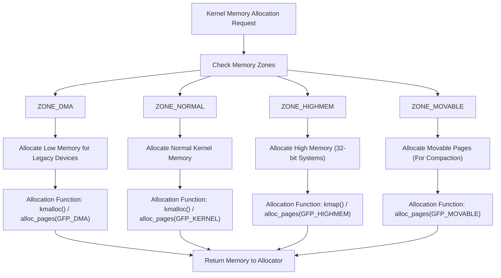
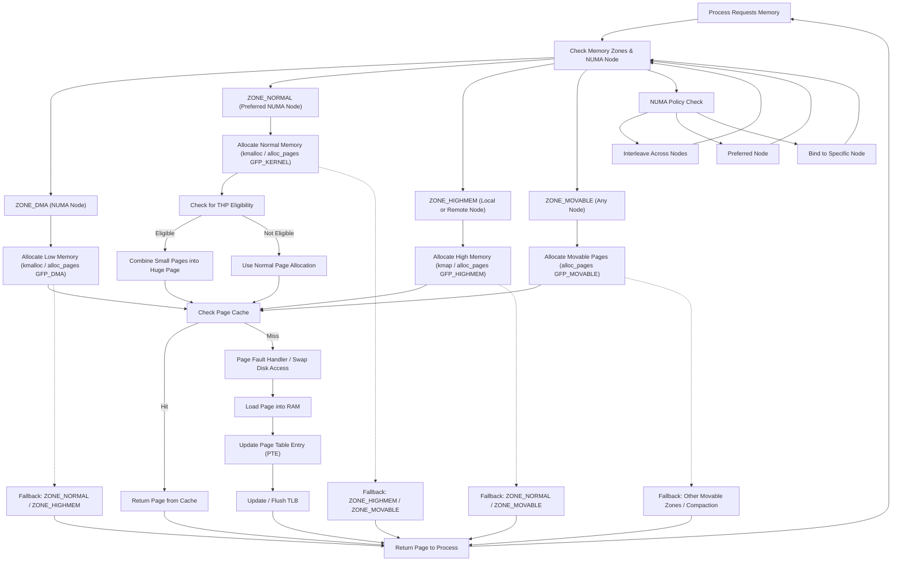
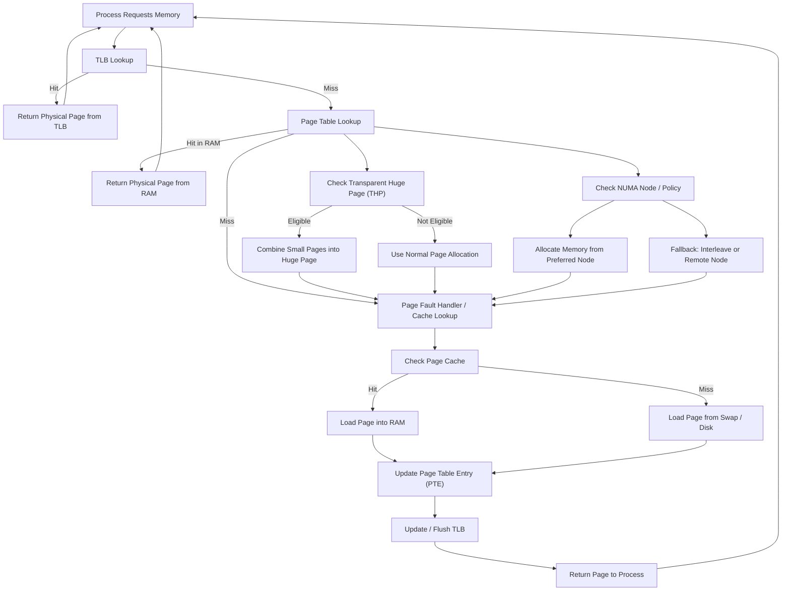
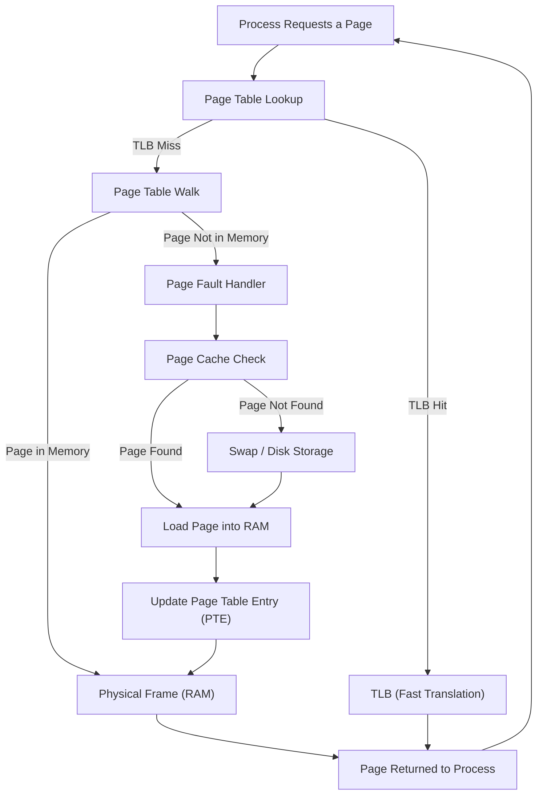

# Chapter 11: Kernel Memory Management

Memory management is one of the most critical subsystems in the Linux kernel. It ensures efficient allocation, tracking, and protection of memory resources across user space, kernel space, and devices. This chapter explores how the kernel manages memory, its key mechanisms, advanced topics, and programming interfaces.

## 11.1 Overview of Kernel Memory Management

Linux memory management aims to provide **efficiency, scalability, isolation, and safety**. It controls both user space and kernel space, ensuring processes do not interfere with each other and resources are utilized effectively.

**Responsibilities include:**

* **Virtual memory management:** Gives each process an isolated view of memory.
* **Physical memory allocation:** Handles RAM blocks and pages.
* **Paging and swapping:** Moves less-used pages to disk.
* **Memory-mapped I/O:** Allows devices to be accessed as memory.
* **Cache and buffer management:** Improves I/O performance.
* **NUMA-aware allocation:** Optimizes memory access on multi-CPU systems.


## 11.2 Virtual vs Physical Memory

* **Virtual Memory:** Each process believes it owns the full address space. The kernel translates virtual addresses to physical ones using **page tables**.
* **Physical Memory:** The actual RAM managed by the kernel.

**Benefits:**

* Isolates processes from each other.
* Allows overcommitting memory via paging.
* Enables demand paging (loading only what’s needed).


## 11.3 Memory Zones

Linux divides memory into zones to handle different hardware and allocation needs:

* **ZONE\_DMA:** Legacy zone for devices that can only access low physical memory.
* **ZONE\_NORMAL:** Directly mapped memory, usable by most kernel operations.
* **ZONE\_HIGHMEM:** High physical memory not permanently mapped (32-bit systems).
* **ZONE\_MOVABLE:** Pages that can be migrated or reclaimed for compaction.

This separation ensures allocations satisfy hardware constraints and fragmentation is reduced.



## 11.4 Page Frame Management

Memory is divided into fixed-size blocks called **pages** (commonly 4 KB). Each page has metadata stored in `struct page`.

**Functions:**

* `alloc_pages(gfp_mask, order)` – Allocates 2^order pages.
* `__free_pages(page, order)` – Frees allocated pages.

**Advanced feature:**

* **Transparent Huge Pages (THP):** Automatically groups small pages into large ones (2 MB, 1 GB) to reduce Translation Lookaside Buffer (TLB) overhead and improve performance.


## 11.5 Slab Allocator

Slab allocation efficiently manages frequently allocated kernel objects (like inodes, dentries, tasks).

**Workflow:**

* Creates caches for object types.
* Allocates objects from pre-initialized slabs.
* Reuses freed objects instead of returning them to the system.

**Advantages:**

* Low fragmentation.
* Faster allocation due to caching.

**API Example:**

```c
struct kmem_cache *cache;
cache = kmem_cache_create("my_cache", sizeof(struct my_struct), 0, 0, NULL);
obj = kmem_cache_alloc(cache, GFP_KERNEL);
kmem_cache_free(cache, obj);
```


## 11.6 Buddy System

The buddy allocator manages free memory by splitting blocks into halves until the required size is found.

**Pros:**

* Simple and efficient for large page allocations.
* Easy merging of adjacent free blocks.

**Cons:**

* Can suffer from external fragmentation.

**Example:**

```c
struct page *pg;
pg = alloc_pages(GFP_KERNEL, order); // 2^order pages
__free_pages(pg, order);
```


## 11.7 kmalloc and vmalloc

* **kmalloc():** Allocates **physically contiguous** memory. Best for DMA buffers and hardware interactions.
* **vmalloc():** Allocates **virtually contiguous** memory but physically scattered. Useful for large allocations.

**Example:**

```c
int *data;
data = kmalloc(1024, GFP_KERNEL);
if (!data) return -ENOMEM;
kfree(data);
```

**Variants:**

* `kzalloc()` – Zero-initialized memory.
* `krealloc()` – Resize allocated memory.


## 11.8 High Memory Management

In 32-bit systems, not all physical memory is permanently mapped due to address space limitations.

**APIs:**

* `kmap(page)` – Temporarily map high memory into kernel space.
* `kunmap(page)` – Unmap a previously mapped page.
* `kmap_atomic(page)` – Provides temporary mapping with restrictions, faster than `kmap`.


## 11.9 Memory Mapping

**mmap()** system call maps files or devices into memory.

**Use cases:**

* Memory-mapped files.
* Device drivers mapping hardware memory into user space.

**Driver Example:**

```c
static int my_mmap(struct file *filp, struct vm_area_struct *vma) {
    return remap_pfn_range(vma, vma->vm_start, phys_addr >> PAGE_SHIFT,
                           vma->vm_end - vma->vm_start, vma->vm_page_prot);
}
```

## 11.10 Swapping and Paging

* **Paging:** Moves inactive memory pages to disk, freeing RAM.
* **Swapping:** Can move entire process memory to disk under heavy pressure.

The kernel uses **page replacement algorithms** (e.g., Least Recently Used - LRU) to decide which pages to evict.

**Control:**

* `/proc/sys/vm/swappiness` defines how aggressively the kernel swaps.


## 11.11 Cache and Buffer Management

* **Page Cache:** Stores file data to speed up I/O.
* **Slab Cache:** Reuses kernel objects like dentries.
* **Buffer Cache:** Manages block device I/O.

These caches reduce expensive disk operations by storing frequently accessed data.


## 11.12 NUMA (Non-Uniform Memory Access)

Modern multi-CPU systems use NUMA architecture, where each CPU socket has its own memory bank.

**Challenges:**

* Accessing remote node memory is slower.

**NUMA policies:**

* **Interleave:** Distributes pages across all nodes evenly.
* **Preferred:** Allocates from a specific node when possible.
* **Bind:** Restricts memory to a given node.

**API Example:**

```c
void *ptr = numa_alloc_onnode(size, node);
```

This ensures memory comes from a specific NUMA node.


## 11.13 Memory Debugging Tools

* **kmemleak:** Kernel memory leak detector. Works like a garbage collector to find unreachable memory.
* **/proc/slabinfo:** Shows detailed statistics about slab caches.
* **page\_owner:** Tracks page allocations, useful for debugging leaks.
* **ftrace & perf:** Performance analysis and tracing tools.

These tools help developers detect memory leaks, fragmentation, and inefficiencies.


## 11.14 Security Considerations

Kernel memory management includes several mechanisms for security:

* **Guard pages:** Prevent buffer overflows by leaving unmapped memory between allocations.
* **Kernel Address Space Layout Randomization (KASLR):** Randomizes kernel memory addresses to prevent exploits.
* **W^X Policy (Write XOR Execute):** Ensures memory cannot be both writable and executable.

These features reduce vulnerabilities such as privilege escalation and code injection attacks.


## 11.15 Visualization: Virtual to Physical Memory Translation

Below is a Mermaid diagram showing the flow from **virtual memory** to **physical memory** with involvement of **page tables, TLB, THP, and caches**.

***Very Highlevel***

> Fallback zones handled if allocation fails.

***less highlevel***


***Simple***



## 11.16 Summary

* Kernel memory management combines **basic mechanisms** (zones, pages, allocators) with **advanced features** (NUMA, THP, debugging tools, security).
* The translation from virtual to physical memory is optimized using **page tables and TLB**.
* Caches and page replacement policies improve performance.

A strong understanding of memory management allows developers to write efficient, safe, and high-performance kernel code.


