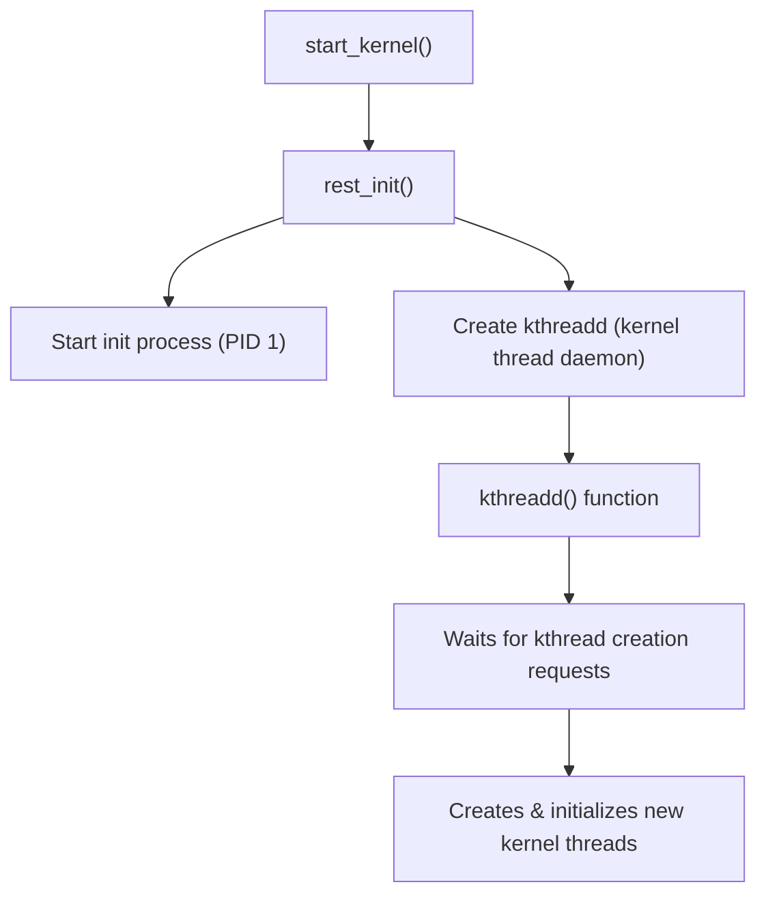
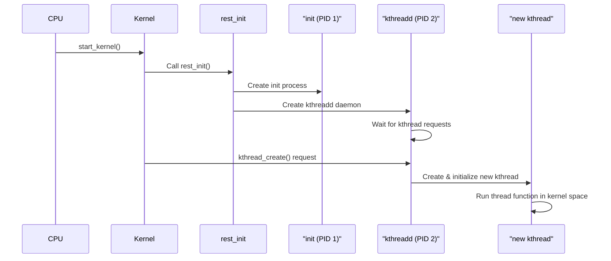

# Chapter 5: Kernel Thread (kthread) Creation During Linux Boot Time

## 5.1 Introduction
Kernel threads (kthreads) are essential components of the Linux kernel.  
- They run entirely in **kernel space**.  
- They are used for background tasks such as memory management, I/O scheduling, and process handling.  
- Unlike user-space threads, **kthreads are created and managed by the kernel itself**.  

## 5.2 Boot-Time kthread Creation Flow

### 5.2.1 Kernel Initialization
- The Linux kernel begins execution in the `start_kernel()` function located in **`init/main.c`**.  
- This function performs system setup and eventually calls **`rest_init()`**.  

### 5.2.2 rest_init() Function
The `rest_init()` function is responsible for:  
- Starting the **init process (PID 1)**.  
- Creating the **kthreadd** kernel thread.  

### 5.2.3 kthreadd Thread
- The **kthreadd** is the **kernel thread daemon**.  
- It is the **parent of all other kernel threads**.  
- It runs the `kthreadd()` function, which:  
  - Waits for requests to create new kernel threads.  
  - Handles their initialization.  

### 5.2.4 Boot-Time kthread Creation Flow (Diagram)

The following diagram shows how the Linux kernel creates `kthreadd` during boot and how it becomes the parent of all other kernel threads:


#### Sequence Diagram (Step-by-Step Flow)



## 5.3 Code Example: Creating a Custom kthread
Below is a simple Linux kernel module that demonstrates how to create and stop a custom kthread.

```c
#include <linux/module.h>
#include <linux/kernel.h>
#include <linux/kthread.h>
#include <linux/delay.h>

static struct task_struct *my_kthread;

// The function executed by the kthread
static int my_kthread_fn(void *data)
{
    printk(KERN_INFO "Custom kthread started\n");

    while (!kthread_should_stop()) {
        printk(KERN_INFO "Custom kthread running...\n");
        ssleep(5); // Sleep for 5 seconds
    }

    printk(KERN_INFO "Custom kthread stopping\n");
    return 0;
}

static int __init my_kthread_init(void)
{
    printk(KERN_INFO "Loading custom kthread module\n");

    // Create and run the kernel thread
    my_kthread = kthread_run(my_kthread_fn, NULL, "my_kthread");

    if (IS_ERR(my_kthread)) {
        printk(KERN_ERR "Failed to create kthread\n");
        return PTR_ERR(my_kthread);
    }

    return 0;
}

static void __exit my_kthread_exit(void)
{
    printk(KERN_INFO "Unloading custom kthread module\n");

    if (my_kthread) {
        kthread_stop(my_kthread);
        printk(KERN_INFO "Custom kthread stopped\n");
    }
}

module_init(my_kthread_init);
module_exit(my_kthread_exit);

MODULE_LICENSE("GPL");
MODULE_AUTHOR("Your Name");
MODULE_DESCRIPTION("Example of a custom kernel thread");

```

### 5.3.1 How It Works

- **`my_kthread_init()`**  
  Called when the module is loaded. It creates a kernel thread using `kthread_run()`.  

- **`my_kthread_fn()`**  
  The thread function, which runs in a loop until `kthread_should_stop()` returns true.  

- **`my_kthread_exit()`**  
  Called when the module is unloaded. It stops the kthread using `kthread_stop()`.  


## 5.4 Detailed Overview of Common Kernel Threads

| Thread Name               | Description                                                                                       |
|----------------------------|---------------------------------------------------------------------------------------------------|
| **kthreadd**               | The first kernel thread created during boot. It is the parent of all other kernel threads.       |
| **ksoftirqd/N**            | Handles soft IRQs (software interrupts) on CPU N. These are deferred interrupt tasks.           |
| **rcu_sched, rcu_preempt** | Manage RCU (Read-Copy-Update) callbacks, used for safe memory reclamation in concurrent environments. |
| **kworker/N:M**            | Perform deferred work from workqueues. General-purpose threads for device probing, filesystem operations, etc. |
| **kswapd0**                | Manages memory pressure by swapping pages out of RAM when needed.                                |
| **watchdog/N**             | Monitors CPU responsiveness and detects soft lockups.                                             |
| **migration/N**            | Handles task migration between CPUs to balance load.                                             |
| **kblockd**                | Handles block I/O operations, such as disk reads/writes.                                         |
| **jbd2/...**               | Manages journaling for ext4 filesystems. Ensures filesystem consistency.                          |
| **khugepaged**             | Scans memory and promotes small pages to huge pages for performance.                              |
| **kcompactd**              | Compacts memory to reduce fragmentation.                                                         |
| **netns**                  | Manages network namespaces.                                                                      |
