```mermaid
flowchart LR
    %% Define parallel tracks
    subgraph Device ["Hardware Device"]
        A["Device Event / IRQ"]
    end

    subgraph CPU ["CPU & Top-Half"]
        B["Interrupt Controller (PIC/APIC)"]
        C["CPU Receives Interrupt"]
        D["Save Context & Disable/Mask Interrupts"]
        E["Top-Half Handler (ISR)"]
    end

    subgraph Kernel ["Bottom-Half & Subsystems"]
        F["Schedule Bottom-Half"]
        G["Bottom-Half Handler: Soft IRQ / Tasklet / Workqueue"]
        H["Interact with Kernel Subsystems"]
        I["Network Stack / Block Layer / Input Subsystem"]
    end

    subgraph Resume ["Return to Previous Task"]
        J["Restore CPU Context"]
        K["Resume Interrupted Task"]
    end

    %% Connections
    A --> B
    B --> C
    C --> D
    D --> E
    E --> F
    F --> G
    G --> H
    H --> I
    I --> J
    J --> K
```

# Chapter 6: Hardware Interrupt Handling in the Linux Kernel

## Introduction
Modern operating systems must respond quickly and efficiently to events generated by hardware devices. These events—such as a key press, network packet arrival, or completed disk operation—are communicated to the CPU via **hardware interrupts**.  

The Linux kernel implements a sophisticated interrupt handling mechanism that ensures minimal latency, high throughput, and system stability.  

This chapter provides a detailed walkthrough of the **lifecycle of a hardware interrupt**, from the moment it is triggered by a device to when the system resumes its previous execution context. Each stage has specific responsibilities and constraints.

## 6.1 Interrupt Generation by Hardware Devices
- A hardware device detects an event requiring CPU attention.  
- It sends an **electrical signal** on its assigned IRQ (Interrupt Request) line.  
- This signal is routed to the system’s **Interrupt Controller** (PIC or APIC).  

## 6.2 Role of the Interrupt Controller
The interrupt controller:
- Identifies the source of the interrupt.  
- Determines its priority relative to other pending interrupts.  
- Forwards the interrupt to the CPU.  

> High-priority interrupts are serviced promptly, while lower-priority ones may be delayed or masked.

## 6.3 CPU Response and Context Saving
Upon receiving the interrupt signal:
- CPU pauses its current execution.  
- Saves the current context (registers, program counter, stack pointer).  
- Disables further interrupts (or selectively masks them).  
- Consults the **Interrupt Descriptor Table (IDT)** to locate the correct **Interrupt Service Routine (ISR)**.  

### What If Another Interrupt Occurs?
- If interrupts are enabled and the new interrupt has higher priority, it can **preempt** the current handler.  
- If interrupts are disabled, the new interrupt is **delayed** until they are re-enabled.  

## 6.4 Execution of the Top-Half Handler
The **top-half handler (ISR)** is registered by the device driver using `request_irq()` and executes in **interrupt context** (non-preemptible, cannot sleep).  

**Responsibilities:**
- Acknowledge and clear the interrupt at device and controller levels.  
- Perform minimal, time-critical operations (e.g., reading device status).  
- Schedule a **bottom-half handler** for deferred processing.  

### Handling Other Interrupts
- Another interrupt may **preempt** the top-half if allowed.  
- Otherwise, it is queued or delayed.  

## 6.5 Bottom-Half Handling: Deferred Work
To offload non-urgent tasks, Linux uses **bottom-half mechanisms** that run in a schedulable context.  

**Types of Bottom-Half Mechanisms:**
| Mechanism | Context       | Preemptible | Use Case                           |
|------------|---------------|------------|------------------------------------|
| Soft IRQ   | Interrupt     | Partially  | High-performance networking/block I/O |
| Tasklet    | Interrupt     | No         | Lightweight deferred work (deprecated) |
| Workqueue | Process       | Yes        | Complex or blocking operations      |

**Responsibilities:**
- Process data collected by the top-half.  
- Interact with kernel subsystems.  
- Wake up user-space processes or kernel threads waiting for the event.  

**Interrupts During Bottom-Half:**
- New interrupts can preempt the bottom-half since it runs in normal kernel context.  
- After handling, the bottom-half resumes.  

## 6.6 Interaction with Kernel Subsystems
The bottom-half often interfaces with:
- **Network stack** → deliver packets to sockets.  
- **Block layer** → complete disk I/O operations.  
- **Input subsystem** → forward keystrokes or mouse events.  

These subsystems may:
- Update kernel data structures.  
- Notify user-space applications.  
- Trigger additional kernel events.  

## 6.7 Returning to the Previous Context
After bottom-half and subsystem processing:
- Kernel restores the previously saved CPU context.  
- CPU resumes execution of the interrupted task:  
  - User-space process  
  - Kernel thread  
  - Another interrupt handler (nested interrupts)  

## 6.8 Summary
Linux divides interrupt handling into **top-half** (ISR) and **bottom-half** (deferred work) for efficiency and modularity:  
- **Top-half:** Handles critical tasks immediately.  
- **Bottom-half:** Performs complex processing in safe, schedulable contexts.  

This structure allows Linux to scale across hardware platforms, from embedded systems to high-performance servers.  

### Key Characteristics of Bottom-Half Mechanisms

| Feature    | Soft IRQ          | Tasklet              | Workqueue                   |
|------------|-----------------|--------------------|-----------------------------|
| Context    | Interrupt        | Interrupt           | Process                     |
| Preemptible| Partially        | No                  | Yes                         |
| Use Case   | High-performance | Lightweight deferred work | Complex/blocking work |

## 6.9 Enhanced Hardware Interrupt Lifecycle (Parallel Tracks)

