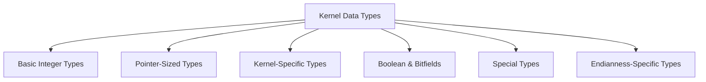
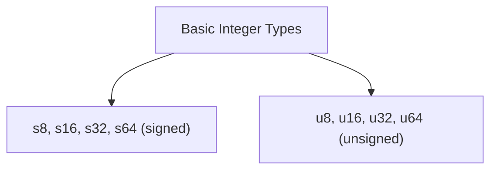
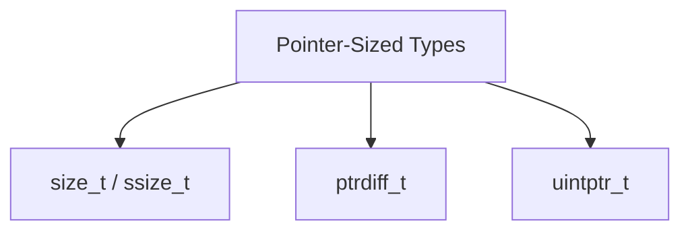
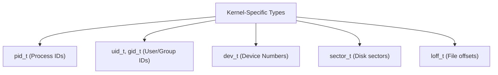
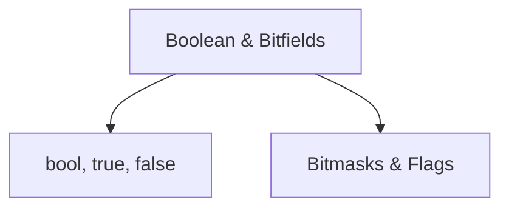
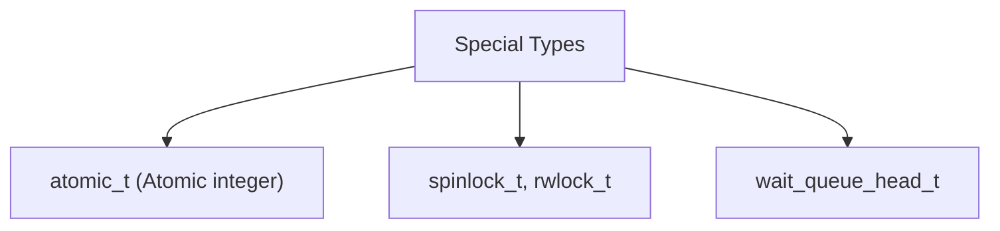
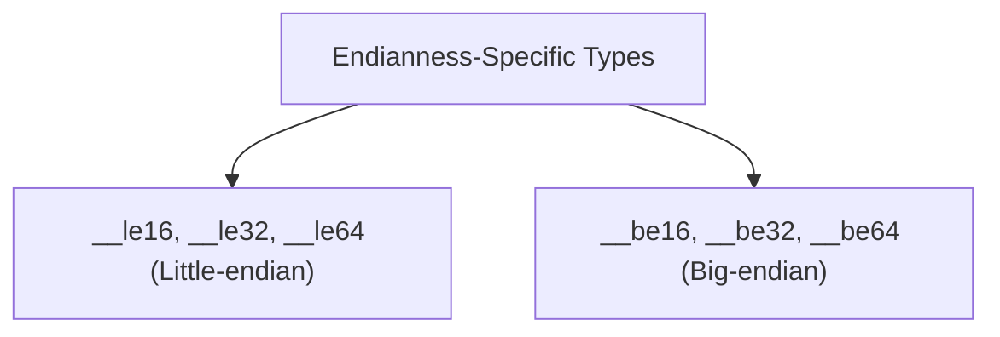
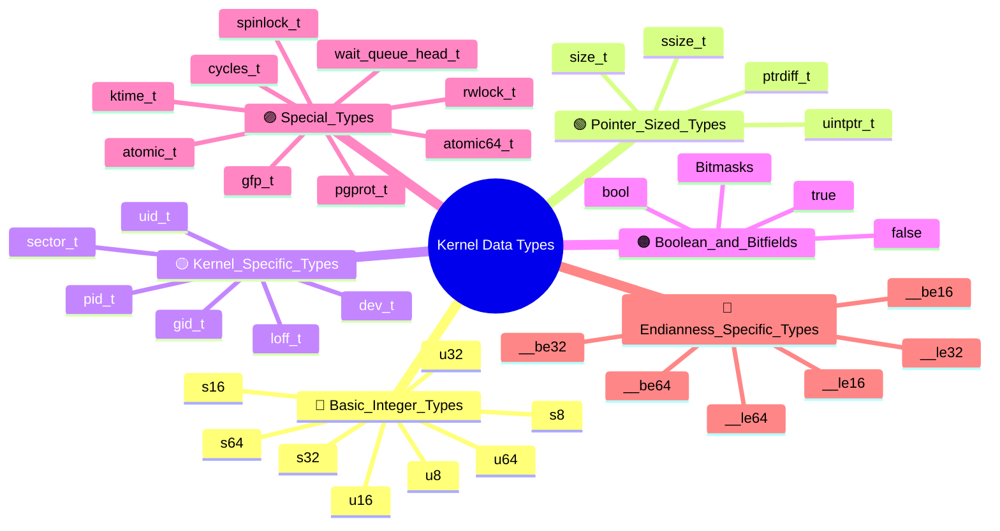

# Chapter 7: Kernel Data Types

## 7.1 Why Kernel Data Types Matter
Kernel programming is fundamentally different from user-space development. The kernel:  

- Must run on **multiple architectures** (x86, ARM, RISC-V, PowerPC, etc.).  
- Cannot rely on the **standard C library** (`libc`).  
- Must interact directly with **hardware**, where register widths and memory alignments matter.  
- Requires **predictable behavior** when storing, transferring, or manipulating data across user–kernel boundaries.  

For this reason, the Linux kernel defines its **own data types** that are **portable, explicit, and self-documenting**.  


## 7.2 Problems with Standard C Types
Using plain C types (`int`, `long`, `short`) is discouraged in kernel code because:  

- The **size varies across architectures**:  
  - On x86 (32-bit): `int = 32 bits`, `long = 32 bits`.  
  - On x86_64: `int = 32 bits`, `long = 64 bits`.  
- Misuse leads to **bugs in memory management, file I/O, and driver development**.  
- Ambiguity makes code **harder to audit**.  

👉 Instead, the kernel uses **clearly defined types** like `u32` or `loff_t`.  

## 7.3 Kernel Datatype


## 7.3.1 Basic Integer Types
Defined in `<linux/types.h>`.  

- **Signed types:**  
  - `s8`  → signed 8-bit  
  - `s16` → signed 16-bit  
  - `s32` → signed 32-bit  
  - `s64` → signed 64-bit  

- **Unsigned types:**  
  - `u8`  → unsigned 8-bit  
  - `u16` → unsigned 16-bit  
  - `u32` → unsigned 32-bit  
  - `u64` → unsigned 64-bit  

### Example – Working with hardware registers
```c
u8 status;       // 8-bit hardware status register
u16 port_val;    // 16-bit I/O port
u32 addr;        // 32-bit memory address
s64 offset;      // large file offset (signed)
```


## 7.3.2 Pointer-Sized Types
Used when the variable must match the **machine word size**.  

- `size_t` → unsigned, represents object sizes.  
- `ssize_t` → signed version of `size_t` (commonly return values of functions).  
- `ptrdiff_t` → result of subtracting two pointers.  
- `uintptr_t` → unsigned integer with the same width as a pointer.  

### Example – Safe memory allocation
```c
size_t len = PAGE_SIZE;
char *buf = kmalloc(len, GFP_KERNEL);
if (!buf)
    return -ENOMEM;
```

## 7.3.3 Kernel-Specific Types
These represent OS-level abstractions.  

- `pid_t` → Process ID.  
- `uid_t` / `gid_t` → User and group IDs.  
- `dev_t` → Encodes major and minor device numbers.  
- `sector_t` → Disk sector (storage addressing).  
- `loff_t` → Large file offsets (signed 64-bit).  

### Example – Creating a device number
```c
dev_t dev = MKDEV(major_num, minor_num);
printk(KERN_INFO "Device number: Major=%d, Minor=%d", MAJOR(dev), MINOR(dev));
```


## 7.3.4 Boolean and Bitfields
- The kernel uses:  
  ```c
  typedef _Bool bool;
  #define true  1
  #define false 0
  ```

- Instead of multiple `bool`s, **bitmasks** store flags efficiently.  



### Example – Flag manipulation
```c
unsigned long flags;
set_bit(0, &flags);   // Enable feature
clear_bit(1, &flags); // Disable feature
if (test_bit(0, &flags))
    printk(KERN_INFO "Feature enabled\n");
```

This reduces memory footprint and improves performance when tracking states.  

## 7.3.5 Special Types
Used for concurrency and synchronization.  

- **Atomic variables:**  
  `atomic_t` type that ensures operations on its variable are indivisible, meaning they cannot be interrupted and are performed as a single, uninterruptible unit across multiple CPUs (or cores) in a system. This property is achieved by leveraging specialized CPU instructions that guarantee `all-or-nothing` execution, preventing other CPUs from seeing partially completed operations and maintaining data integrity in concurrent environments.  
 
  ```c
  atomic_t refcount = ATOMIC_INIT(1);
  atomic_inc(&refcount);   // Safe increment
  atomic_dec(&refcount);   // Safe decrement
  ```

- **Locks:**  
  - `spinlock_t` → Busy-wait lock for critical sections.  
  - `rwlock_t` → Reader-writer lock.  

- **Wait queues:**  
  - `wait_queue_head_t` → Used for process sleep/wakeup in device drivers.  



### Example – Spinlock usage
```c
spinlock_t mylock;
spin_lock_init(&mylock);

spin_lock(&mylock);
// critical section
spin_unlock(&mylock);
```

## 7.3.6 Endianness-Specific Types
Different CPUs use different byte orders.  

- **Little-endian types:**  
  - `__le16`, `__le32`, `__le64`  

- **Big-endian types:**  
  - `__be16`, `__be32`, `__be64`  

These ensure correctness in **networking** (big-endian) and **x86 memory** (little-endian).  

### Example – Handling network packets
```c
__be32 ip_addr = htonl(0xC0A80001); // 192.168.0.1 in big-endian
```



## 7.3.7 Additional Kernel Types
- `ktime_t` → High-resolution kernel time.  
- `cycles_t` → CPU cycle counter.  
- `gfp_t` → Flags for memory allocation (`kmalloc`).  
- `pgprot_t` → Page protection attributes.  
- `atomic64_t` → 64-bit atomic variables.  

---

## 7.4 Best Practices
- ✅ Use **explicit-width types** (`u32`, `s64`) when working with hardware or filesystems.  
- ✅ Use **pointer-sized types** (`size_t`, `ssize_t`) when working with memory buffers.  
- ✅ Use **endianness types** when handling network or cross-platform data.  
- ✅ Use **kernel abstractions** (`pid_t`, `dev_t`) for process and device operations.  
- ❌ Avoid plain `int`, `long`, etc. in exported interfaces.  

---

## 7.5 Summary
Kernel data types provide:  
- **Portability** across architectures.  
- **Clarity** in code semantics.  
- **Safety** in memory and hardware operations.  
- **Efficiency** in synchronization and flag handling.  


## 7.12 Visual Summary: Kernel Data Types




