# Chapter 6: Different kernel data types

## Introduction
In kernel programming (especially in Linux kernel development), the C language is used, but the kernel avoids standard C library (libc) types and instead defines its own portable, architecture-independent data types.

```mermaid
flowchart TD
    A["Kernel Data Types"] --> B["Basic Integer Types"]
    A --> C["Pointer-Sized Types"]
    A --> D["Kernel-Specific Types"]
    A --> E["Boolean & Bitfields"]
    A --> F["Special Types"]
    A --> G["Endianness-Specific Types"]

    B --> B1["s8, s16, s32, s64 (signed)"]
    B --> B2["u8, u16, u32, u64 (unsigned)"]

    C --> C1["size_t / ssize_t"]
    C --> C2["ptrdiff_t"]
    C --> C3["uintptr_t"]

    D --> D1["pid_t (Process IDs)"]
    D --> D2["uid_t, gid_t (User/Group IDs)"]
    D --> D3["dev_t (Device Numbers)"]
    D --> D4["sector_t (Disk sectors)"]
    D --> D5["loff_t (File offsets)"]

    E --> E1["bool, true, false"]
    E --> E2["Bitmasks & Flags"]

    F --> F1["atomic_t (Atomic integer)"]
    F --> F2["spinlock_t, rwlock_t"]
    F --> F3["wait_queue_head_t"]

    G --> G1["__le16, __le32, __le64 (Little-endian)"]
    G --> G2["__be16, __be32, __be64 (Big-endian)"]

    %% Styling categories
    style A fill:#f0f0f0,stroke:#333,stroke-width:2px
    style B fill:#77B5FE,stroke:#333,stroke-width:2px
    style C fill:#90EE90,stroke:#333,stroke-width:2px
    style D fill:#FFD700,stroke:#333,stroke-width:2px
    style E fill:#FFA500,stroke:#333,stroke-width:2px
    style F fill:#DA70D6,stroke:#333,stroke-width:2px
    style G fill:#FF6347,stroke:#333,stroke-width:2px

```

