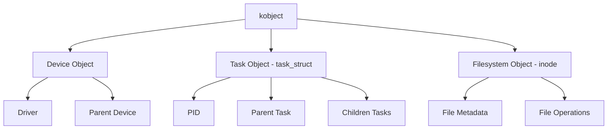

# Chapter 8: Objects in the Linux Kernel

## 8.1 What is a Kernel Object?

A **kernel object** is any structured data type in the kernel that encapsulates:

1. **Data fields** — representing the state or properties of the object.
2. **Operations** — functions or callbacks that act on the object.
3. **Reference counting** — for safe memory management.
4. **Synchronization primitives** — ensuring safe access in concurrent contexts.

Examples:

* `struct task_struct` — represents a process.
* `struct inode` — represents a filesystem object.
* `struct device` — represents a hardware device.
* `struct kobject` — the core kernel object for the sysfs subsystem.

---

## 8.2 The kobject: The Core Kernel Object

The **`kobject`** is central to kernel object management, used primarily in **sysfs** and **device model**:

```c
struct kobject {
    const char *name;
    struct kobject *parent;
    struct kobj_type *ktype;
    struct list_head entry;
    struct kref kref;
};
```

### Key Features of kobject

1. **Hierarchy:** Objects can have parents and children, forming a tree structure.
2. **Reference Counting:** Ensures objects are freed only when no references remain.
3. **Type System (`kobj_type`):** Defines object operations like `release` and `sysfs` show/store callbacks.
4. **Sysfs Integration:** Automatically creates entries under `/sys` for userspace visibility.

### Example Usage

```c
struct kobject *example_kobj;

example_kobj = kobject_create_and_add("my_object", kernel_kobj);
if (!example_kobj)
    return -ENOMEM;
```

---

## 8.3 Reference Counting

```c
struct kref {
    atomic_t refcount;
};

kref_get(&obj->kref);   // Increment
kref_put(&obj->kref, release_function);  // Decrement and release
```

* Increment when a new reference is acquired.
* Decrement when a reference is released; the object is freed automatically if the count reaches zero.

---

## 8.4 Common Kernel Objects

### 8.4.1 Task Structure (`task_struct`)

* Represents a process.
* Contains scheduling info, PID, state, parent/child pointers.

```c
struct task_struct {
    volatile long state;
    pid_t pid;
    struct task_struct *parent;
    struct list_head children;
    struct mm_struct *mm;
    ...
};
```

### 8.4.2 Device Structure (`device`)

* Represents physical/logical devices.
* Includes device number, driver pointer, parent device, kobject.

```c
struct device {
    dev_t devt;
    struct device_driver *driver;
    struct kobject kobj;
    struct device *parent;
    ...
};
```

### 8.4.3 Filesystem Objects (`inode`)

* Represents files/directories.
* Stores metadata and file operations.

```c
struct inode {
    umode_t i_mode;
    uid_t i_uid;
    gid_t i_gid;
    struct super_block *i_sb;
    struct file_operations *i_fop;
    ...
};
```

---

## 8.5 Object Hierarchy in Kernel

Kernel objects often form **hierarchies**:

```
kernel_kobj
 ├─ device1
 │   ├─ subdevice1
 │   └─ subdevice2
 └─ device2
```

* Parent objects manage child objects.
* Lifecycle often depends on parent reference counting.

---

## 8.6 Object Operations

Common callbacks include:

* **Release:** Called when reference count reaches zero.
* **Show / Store:** Sysfs attribute access.
* **Probe / Remove:** Device driver binding/unbinding.

```c
struct kobj_type example_ktype = {
    .release = example_release,
    .sysfs_ops = &example_sysfs_ops,
};
```

---

## 8.7 Synchronization

Kernel objects often need thread-safe access using:

* **Spinlocks** — short critical sections, interrupt context.
* **Mutexes** — long critical sections, process context.
* **RCU** — read-mostly structures.

---

## 8.8 Best Practices

1. Always use **reference counting**.
2. Use **embedded kobjects** for sysfs integration.
3. Avoid direct freeing; rely on `kref_put`.
4. Maintain **hierarchy** for easier tracking.
5. Use proper **synchronization** for concurrent access.

---

## 8.9 Summary

* Kernel objects represent **resources and abstractions**.
* `kobject` is the **core building block**.
* Key objects: `task_struct`, `device`, `inode`.
* Correct **reference counting and synchronization** are essential.
* Objects often form **hierarchies** and integrate with **sysfs**.

---

## 8.10 Kernel Object Hierarchy Diagram


## 8.11 Example: Complete kobject Usage

```c
// File: kobject_example.c
#include <linux/module.h>
#include <linux/kernel.h>
#include <linux/init.h>
#include <linux/kobject.h>
#include <linux/sysfs.h>
#include <linux/slab.h>

MODULE_LICENSE("GPL");
MODULE_AUTHOR("OpenAI");
MODULE_DESCRIPTION("Example of kobject usage in Linux kernel");

static struct kobject *example_kobj;
static int example_value = 0;

/* Sysfs show function */
static ssize_t example_show(struct kobject *kobj,
                            struct kobj_attribute *attr, char *buf)
{
    return sprintf(buf, "%d\n", example_value);
}

/* Sysfs store function */
static ssize_t example_store(struct kobject *kobj,
                             struct kobj_attribute *attr,
                             const char *buf, size_t count)
{
    int ret;
    ret = kstrtoint(buf, 10, &example_value);
    if (ret < 0)
        return ret;
    return count;
}

/* Define a kobj_attribute structure */
static struct kobj_attribute example_attribute =
    __ATTR(example_value, 0664, example_show, example_store);

/* Release function called when kobject is freed */
static void example_release(struct kobject *kobj)
{
    pr_info("kobject released\n");
}

static int __init kobject_example_init(void)
{
    int error = 0;

    pr_info("Initializing kobject example module\n");

    /* Create kobject under /sys/kernel/ */
    example_kobj = kobject_create_and_add("example_kobject", kernel_kobj);
    if (!example_kobj)
        return -ENOMEM;

    /* Initialize reference count manually if needed */
    kobject_init(example_kobj, &(struct kobj_type){ .release = example_release });

    /* Create sysfs file associated with this kobject */
    error = sysfs_create_file(example_kobj, &example_attribute.attr);
    if (error) {
        pr_err("Failed to create sysfs file\n");
        kobject_put(example_kobj);
        return error;
    }

    pr_info("kobject example created successfully\n");
    return 0;
}

static void __exit kobject_example_exit(void)
{
    pr_info("Exiting kobject example module\n");

    /* Remove sysfs file */
    sysfs_remove_file(example_kobj, &example_attribute.attr);

    /* Put kobject (decrement reference count and free) */
    kobject_put(example_kobj);
}

module_init(kobject_example_init);
module_exit(kobject_example_exit);

```
## 8.11.1 Makefile for the Module

```makefile
KDIR ?= /lib/modules/$(shell uname -r)/build
MODULE_NAME = kobject_example

all:
	$(MAKE) -C $(KDIR) M=$(PWD) modules

clean:
	$(MAKE) -C $(KDIR) M=$(PWD) clean

install:
	@echo "Use insmod/rmmod to insert/remove the module"

.PHONY: all clean install
```

## 8.11.2 Insert the module:
```bash
sudo insmod kobject_example.ko
```

## 8.11.3 Check the sysfs entry:
```bash
cat /sys/kernel/example_kobject/example_value
echo 42 | sudo tee /sys/kernel/example_kobject/example_value
cat /sys/kernel/example_kobject/example_value
```

