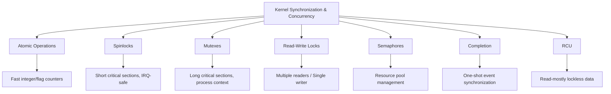

# Chapter 9: Kernel Synchronization and Concurrency

Concurrency and synchronization are fundamental concepts in Linux kernel programming. The kernel handles multiple processes, interrupts, and threads simultaneously. Proper understanding of **execution contexts** and **synchronization primitives** is crucial to write correct, efficient, and safe kernel code.


## 9.1 Why Kernel Synchronization is Needed

* Multiple CPUs may access the same memory or hardware simultaneously.
* Interrupts may preempt running code.
* Shared kernel objects like `task_struct`, devices, and buffers may be accessed concurrently.
* Race conditions can cause data corruption if not synchronized.

**Goals:**

* Ensure atomicity of critical operations.
* Prevent race conditions and deadlocks.
* Maintain performance by minimizing blocking.


## 9.2 Execution Contexts in the Kernel

The Linux kernel executes code in different contexts, which determines what operations are safe:

1. **Process Context**
   - Code runs on behalf of a process.
   - Can sleep (e.g., wait for I/O).
   - Can use blocking functions like `msleep()`.
   - Examples: System calls (`read()`, `write()`), Kernel threads (`kthread_create`).

2. **Interrupt Context**
   - Code runs in response to a hardware interrupt.
   - Cannot sleep or perform blocking operations.
   - Should be fast and efficient.
   - Subdivided into:
     - **Top Half (ISR)**: Immediate response to hardware, minimal work.
     - **Bottom Half (SoftIRQ / Tasklet / Workqueue)**: Deferred processing; workqueues can sleep.

3. **Atomic Context**
   - Code running with interrupts disabled or with spinlocks.
   - Cannot sleep.
   - Must complete quickly to avoid deadlocks or priority inversion.


## 9.3 Types of Concurrency in Kernel

1. **Preemption**: Higher priority tasks can interrupt lower priority tasks in a preemptive kernel.
2. **Interrupts**: Hardware interrupts can occur anytime; shared data must be protected.
3. **Kernel Threads**: Independent threads in process context (`kthread_create`, `kthread_run`).
4. **SoftIRQs and Tasklets**:
   - SoftIRQ: High-frequency deferred tasks, cannot sleep.
   - Tasklet: Serialized per type, built on SoftIRQ, cannot sleep.
5. **Workqueues**: Deferred execution in process context; can sleep for heavy processing.


## 9.4 Kernel Synchronization Primitives

### 9.4.1 Atomic Operations
**Description:** Atomic operations provide indivisible, low-level operations for integers or flags. They are primarily used to maintain counters or simple flags that may be accessed simultaneously by multiple threads or CPUs.

**Use Cases:**

* Reference counting (e.g., kobject reference count).
* Incrementing/decrementing shared counters.
* Simple status flags that need atomic update.

```c
#include <linux/atomic.h>

static atomic_t counter = ATOMIC_INIT(0);

void increment_counter(void) { 
    atomic_inc(&counter); 
}

void decrement_counter(void) {
    atomic_dec(&counter); 
}

int get_counter(void) { 
    return atomic_read(&counter); 
}
```

**Pros:**

* Very fast, low overhead.
* Works in any context including interrupt context.

**Cons:**

* Only suitable for simple integer or flag operations.
* Cannot protect complex data structures.

---

### 9.4.2 Spinlocks
**Description:** Spinlocks are busy-wait locks that repeatedly check if the lock is available. They are used to protect short critical sections where sleeping is not allowed, including interrupt context.

**Use Cases:**

* Protecting small shared variables in SMP systems.
* Short critical sections in device drivers or interrupt handlers.

```c
#include <linux/spinlock.h>
static spinlock_t my_lock;
void example_spinlock(void) {
    unsigned long flags;
    spin_lock_init(&my_lock);

    spin_lock_irqsave(&my_lock, flags);
    // critical section
    spin_unlock_irqrestore(&my_lock, flags);
}
```

**Pros:**

* Works in interrupt context.
* Low overhead for short critical sections.

**Cons:**

* Cannot sleep while holding the lock.
* Busy-wait wastes CPU cycles if held too long.
---
### 9.4.3 Mutexes
**Description:** Mutexes are sleeping locks used to protect critical sections that may involve longer operations or can sleep. They are only usable in process context.

**Use Cases:**

* File system operations.
* Long-running device operations.
* Critical sections that may sleep or perform I/O.

```c
#include <linux/mutex.h>
static DEFINE_MUTEX(my_mutex);
void example_mutex(void) {
    mutex_lock(&my_mutex);
    // critical section
    mutex_unlock(&my_mutex);
}
```

**Pros:**

* Allows long critical sections without busy-waiting.
* Can sleep safely.

**Cons:**

* Cannot be used in interrupt context.
* Slightly higher overhead than spinlocks.

---

### 9.4.4 Read-Write Locks (rwlock)
**Description:** Read-write locks allow multiple concurrent readers or a single writer. They are designed for shared data structures where reads are frequent and writes are rare.

**Use Cases:**

* Read-mostly kernel data structures.
* Device driver shared buffers.
* Caches that are frequently read but rarely updated.

```c
#include <linux/rwlock.h>

static rwlock_t my_rwlock = RW_LOCK_UNLOCKED;

void example_rwlock_read(void) {
    read_lock(&my_rwlock);
    // read shared data
    read_unlock(&my_rwlock);
}

void example_rwlock_write(void) {
    write_lock(&my_rwlock);
    // modify shared data
    write_unlock(&my_rwlock);
}
```

**Pros:**

* High concurrency for readers.
* Efficient for read-heavy workloads.

**Cons:**

* Writers block readers and vice versa.
* Slightly more complex to use.
---

### 9.4.5 Semaphores
**Description:** Semaphores are counting locks that manage access to multiple instances of a resource. Tasks attempting to acquire the semaphore decrement the count and wait if the resource is unavailable.

**Use Cases:**

* Limiting concurrent access to a resource pool.
* Synchronizing multiple tasks/processes.
* Implementing producer-consumer patterns.

```c
#include <linux/semaphore.h>
static DECLARE_SEMAPHORE(my_sem);

void example_semaphore(void) {

    if (down_interruptible(&my_sem)) return;
    // critical section
    
    up(&my_sem);
}
```

**Pros:**

* Can sleep while waiting.
* Can manage multiple units of a resource.

**Cons:**

* Cannot be used in interrupt context.
* Higher overhead than mutexes.
---

### 9.4.6 Completion
**Description:** Completion variables are used for tasks to wait for a **specific one-time event** to occur, typically signaled by another task.

**Use Cases:**

* Waiting for I/O completion.
* Driver event signaling.
* Simple one-time task synchronization.

```c
#include <linux/completion.h>

static DECLARE_COMPLETION(my_completion);

void producer(void) { 
    complete(&my_completion); 
}

void consumer(void) {
    wait_for_completion(&my_completion); 
}
```

**Pros:**

* Simple one-shot synchronization.
* Automatically handles task sleep and wake.

**Cons:**

* Not suitable for repeated events.
* Only one-time signaling.
---

### 9.4.7 RCU (Read-Copy-Update)
**Description:** RCU is a **lockless mechanism** designed for read-mostly data. Readers can access the data concurrently without locks, while writers update by creating new copies and waiting for a grace period.

**Use Cases:**

* High-performance, read-mostly kernel data structures.
* Network packet routing tables.
* Read-heavy caches and lookup tables.

```c
#include <linux/rcupdate.h>
struct my_data { int value; };

static struct my_data *data_ptr;

void reader(void) {
    struct my_data *p;
    rcu_read_lock();
    p = rcu_dereference(data_ptr);
    rcu_read_unlock();
}

void updater(void) {
    struct my_data *new_data = kmalloc(sizeof(*new_data), GFP_KERNEL);
    new_data->value = 42;
    rcu_assign_pointer(data_ptr, new_data);
    synchronize_rcu();
}
```

**Pros:**

* Readers never block.
* Excellent scalability for multi-core systems.
* High concurrency for read-mostly data.

**Cons:**

* Complex to implement.
* Writers must manage memory and wait for grace periods.
---

## 9.5 Comparison Table

| Primitive       | Context               | Can Sleep    | Readers/Writer   | Use Cases                               | Pros                                 | Cons                                |
| --------------- | --------------------- | ------------ | ---------------- | --------------------------------------- | ------------------------------------ | ----------------------------------- |
| Atomic          | Any                   | No           | N/A              | Counters, flags                         | Fast, works in any context           | Only simple integers/flags          |
| Spinlock        | Any (except sleeping) | No           | N/A              | Short critical sections, IRQ            | Works in IRQ, low overhead           | Cannot sleep, busy-wait overhead    |
| Mutex           | Process               | Yes          | N/A              | Long critical sections, can sleep       | Can sleep, suitable for long ops     | Cannot use in IRQ, higher overhead  |
| Read-Write Lock | Process               | Yes          | Multiple readers | Read-mostly data                        | High concurrency for reads           | Writers block readers, more complex |
| Semaphore       | Process               | Yes          | N/A              | Resource counting, producer-consumer    | Can manage multiple resources        | Cannot use in IRQ, higher overhead  |
| Completion      | Process               | Yes          | N/A              | One-shot event signaling                | Simple, handles sleep/wake           | Only one-time event                 |
| RCU             | Any (read mostly)     | No (readers) | Multiple readers | Read-mostly high-performance structures | Readers never block, highly scalable | Complex, writers must manage memory |

---

## 9.6 Context Restrictions

| Context           | Can Sleep | Can Block | Can Use Spinlock | Can Use Mutex |
|------------------|-----------|-----------|-----------------|---------------|
| Process Context   | ✅ Yes    | ✅ Yes    | ✅ Yes           | ✅ Yes        |
| Interrupt (ISR)   | ❌ No     | ❌ No     | ✅ Yes           | ❌ No         |
| SoftIRQ / Tasklet | ❌ No     | ❌ No     | ✅ Yes           | ❌ No         |
| Workqueue         | ✅ Yes    | ✅ Yes    | ✅ Yes           | ✅ Yes        |

---

## 9.7 Example: Deferred Work

**Scenario:** Network driver ISR receives a packet.

```c
irqreturn_t my_isr(int irq, void *dev_id) {
netif_schedule_work(&my_work); // schedule bottom half
return IRQ_HANDLED;
}

void my_work_func(struct work_struct *work) {
// Process the packet; can sleep
}
```


- ISR is fast, cannot sleep.
- Workqueue handles heavy processing safely.

---

## 9.8 Mermaid Diagrams

**Synchronization Overview:**



