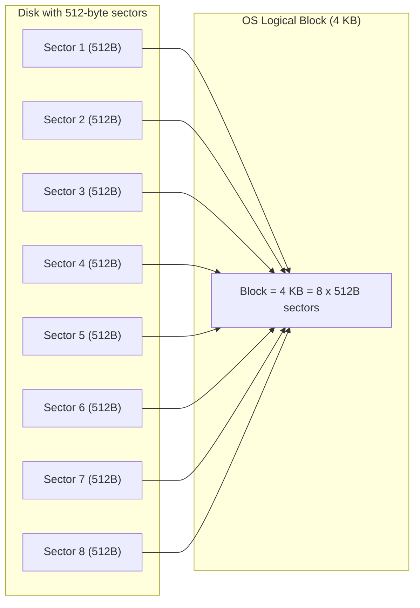
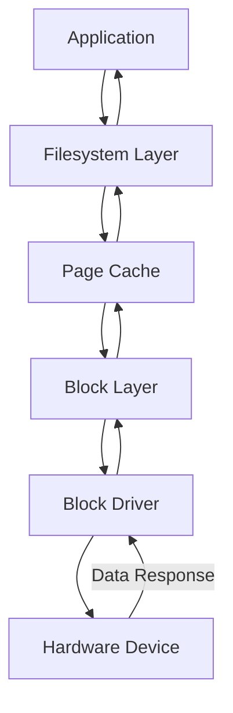
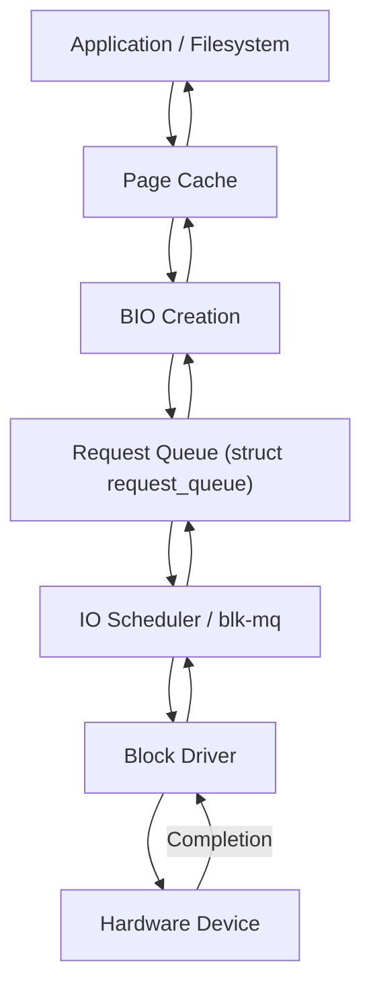
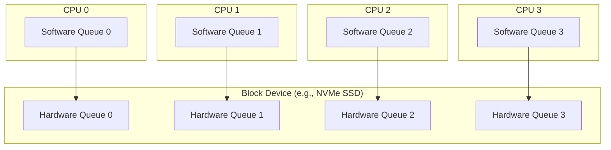
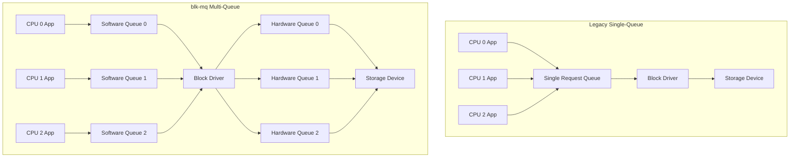

# Chapter 2: Block Device Concepts

Understanding block device drivers requires knowledge of how block devices operate at the OS level. This chapter introduces the fundamental concepts that define the behavior and architecture of block drivers in Linux.

##2.1 Block Size and Sector Concepts

- **Sector**:  
  The smallest physical storage unit on a block device.  
  - Common sector sizes: 512 bytes or 4096 bytes (4K sector disks).  
  - Defined by the hardware.

- **Block**:  
  The smallest logical unit the OS uses when interacting with block devices.  
  - Typically larger than the physical sector (e.g., 4 KB blocks built on 512-byte sectors).  
  - Defined by the filesystem and kernel block layer.

- **Key Difference**:  
  - Sector = hardware-defined smallest readable/writable unit.  
  - Block = OS/kernel-defined logical unit for efficient data management.

- Example:  
  A disk with **512-byte sectors** might still expose **4 KB blocks** to the filesystem for efficiency.
### 2.1.1 Block Size and Sector Concepts (Pictorial Representation)

- **Sector**: The smallest physical storage unit (defined by hardware).  
  Example: `512 bytes` or `4096 bytes (4K sector)`  

- **Block**: The logical storage unit (defined by the OS).  
  Example: `4 KB block = 8 sectors of 512 bytes`  

---

### Diagram: Sector vs Block


---

## 2.2 Buffer Cache & Page Cache Interaction

- **Buffer Cache (historical)**:  
  - Used in older Linux systems for caching disk blocks.  
  - Operated at the block device level.

- **Page Cache (modern Linux)**:  
  - Unified memory cache used for both filesystems and block devices.  
  - Stores whole memory pages (commonly 4 KB) rather than fixed-size blocks.  
  - Ensures efficient file I/O by avoiding repeated disk access.

- **Interaction with Block Devices**:  
  1. When a process requests data, the kernel first checks the **page cache**.  
  2. If the data is present (cache hit), it is served from RAM.  
  3. If not (cache miss), the block driver reads from the device into the cache.  
  4. Write operations may be cached (write-back) and later flushed to the disk.

- **Advantages**:  
  - Reduces disk I/O latency.  
  - Enables readahead, delayed writes, and efficient memory usage.  


## 2.3 Major and Minor Numbers

- **Device Numbers** uniquely identify devices in Linux.

- **Major Number**:  
  - Identifies the driver associated with the device.  
  - Example: All disks handled by the `sd` driver share the same major number.

- **Minor Number**:  
  - Identifies individual devices (or partitions) that use the same driver.  
  - Example: `/dev/sda1` and `/dev/sda2` are partitions with different minor numbers under the same major number.

- **How it Works**:  
  - When a block device file is opened (e.g., `/dev/sda`), the kernel looks at the **major number** to find the driver, then passes the **minor number** so the driver can locate the exact device/partition.

- **Command Example**:
  ```bash
  ls -l /dev/sda
  brw-rw---- 1 root disk 8, 0 Sep 21 10:00 /dev/sda
  ```

  Here, **8** is the major number and **0** is the minor number.  


## 2.4 Block Layer Architecture in Linux

The **Linux block layer** acts as a middle layer between filesystems and block drivers. It manages **I/O scheduling, request queues, and communication with hardware**.

### Components

- **Application**: Issues read/write system calls.  
- **Filesystem Layer**: Translates file operations into block I/O requests.  
- **Page Cache**: Caches frequently accessed data in RAM.  
- **Block Layer**:  
  - Manages request queues (`struct request_queue`).  
  - Schedules I/O requests (elevator algorithms, blk-mq).  
  - Breaks down large I/O requests into sectors or merges them.  
- **Block Driver**: Executes requests on the actual hardware.  
- **Hardware Device**: Physical disk, SSD, or storage controller.  

---

### Data Flow (simplified)




The **Linux block layer** acts as a middle layer between filesystems and block drivers. It manages **I/O scheduling, request queues, and communication with hardware**.

## 2.4 Block Layer Architecture in Linux (Detailed)

The **Linux block layer** is the middle layer between filesystems (or applications using raw block I/O) and block device drivers. Its main job is to handle I/O requests efficiently, optimize access patterns, and provide a uniform API for device drivers.

---

### 2.4.1 Role of the Block Layer

- Acts as a **traffic manager** for I/O requests.  
- Collects, merges, splits, and reorders requests to maximize performance.  
- Provides abstraction so that filesystems and applications do not need to know about hardware-specific details.  
- Implements scheduling policies (I/O schedulers, multi-queue).  

---

### 2.4.2 Key Components

#### 1. **Request Queue (`struct request_queue`)**
- Each block device has a request queue.  
- Holds pending I/O operations (read/write).  
- The queue is processed by the block driver when the device is ready.  
- Supports **merging adjacent requests** into larger ones for efficiency.

#### 2. **BIO (`struct bio`)**
- Represents the basic unit of block I/O.  
- Contains information like:
  - Start sector  
  - Number of sectors  
  - Memory pages involved  
- BIOs are combined into requests before being sent to the driver.

#### 3. **I/O Scheduler (Elevator)**
- Decides the order of processing requests in the queue.  
- Common schedulers:
  - **CFQ (Completely Fair Queuing)**: balances fairness among processes.  
  - **Deadline**: ensures requests are served within deadlines.  
  - **NOOP**: simple FIFO, often used for SSDs.  
- Goal: Minimize seek time on spinning disks and balance latency vs throughput.

#### 4. **Multi-Queue Block Layer (blk-mq)**
- Modern replacement for the legacy single request queue.  
- Features:
  - **Per-CPU software queues**: avoid contention and locking overhead.  
  - **Hardware dispatch queues**: map directly to device hardware queues.  
  - Improved scalability for high IOPS devices like NVMe SSDs.

---

### 2.4.3 Data Flow (Detailed)



### 2.4.4 Request Lifecycle

1. **Application issues I/O**  
   - A read/write syscall is made.  
   - Filesystem translates it into block I/O.  

2. **BIO created**  
   - The kernel builds a `struct bio` representing the operation.  

3. **BIO submitted to request queue**  
   - The request queue collects BIOs.  
   - Adjacent BIOs may be merged.  

4. **I/O Scheduler decides execution order**  
   - Scheduler reorders requests (e.g., shortest seek first on HDD).  

5. **Block driver executes request**  
   - Driver programs the device (e.g., sends command to disk controller).  

6. **Hardware completes operation**  
   - On completion, driver notifies block layer.  
   - Data copied into page cache (for reads).  

7. **Application notified**  
   - Process resumes once data is available (read) or write is confirmed.  


---

### 2.4.5 Performance Features

- **Readahead**: Kernel pre-fetches blocks into page cache to optimize sequential reads.  
- **Write-back caching**: Writes go to cache first, flushed later for performance.  
- **Direct I/O**: Applications can bypass the cache for specific workloads (e.g., databases).  
- **Scatter-Gather I/O**: Allows reading/writing multiple memory regions in a single request.  

---

### 2.4.6 Example: NVMe with blk-mq

- NVMe SSDs support **thousands of hardware queues**.  
- **blk-mq** maps per-CPU software queues to NVMe hardware queues.  
- Each CPU core can issue I/O independently, achieving **millions of IOPS**. 

---
#### 2.4.7 Multi-Queue Block Layer (blk-mq) Architecture

Modern Linux uses **blk-mq** (multi-queue block layer) to fully utilize high-performance devices like NVMe SSDs.  

- Each CPU has its own **software submission queue**.  
- These map to **hardware dispatch queues** supported by the device.  
- This avoids lock contention and improves scalability on multi-core systems.  

---

## Diagram: blk-mq Architecture


### ✅ How It Works

#### 1. Application Issues I/O
- I/O requests are created and submitted from user space.

#### 2. Per-CPU Software Queues
- Each CPU places requests into its own submission queue.  
- Avoids contention with other CPUs.

#### 3. Mapping to Hardware Queues
- Software queues are mapped 1:1 or N:M to device hardware queues.  
- Devices like NVMe have many queues, enabling parallelism.

#### 4. Hardware Execution
- The storage device processes requests independently on multiple queues.


### Benefits of blk-mq

- Scales with **multi-core CPUs**.  
- Matches **multi-queue hardware** (NVMe, SCSI, etc.).  
- Removes bottlenecks of **single-queue architecture**.  
- Supports **millions of IOPS** in modern systems.


### 2.4.8 Legacy Single-Queue vs blk-mq Multi-Queue

Modern storage devices (like NVMe SSDs) can process thousands of I/O operations in parallel.  
The legacy single-queue architecture became a bottleneck, which led to the introduction of **blk-mq**.

---

## Diagram: Single-Queue vs Multi-Queue



