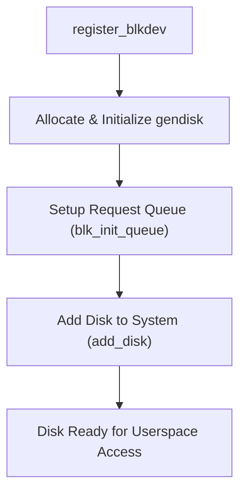

# Chapter 3: Driver Initialization

Block driver initialization is the first step in making a device accessible to the Linux kernel. This chapter explains how a block driver is registered, initialized, and integrated with the system.

---

## 3.1 Registering a Block Device (`register_blkdev`)

- **Purpose**:  
  - Registers the block device with the kernel and allocates a **major number**.  
  - The major number uniquely identifies the driver in the system.

- **Function Prototype**:  
    ```c
    int register_blkdev(unsigned int major, const char *name);
    ```
    - **`major`**: Desired major number (use `0` for dynamic allocation).  
    - **`name`**: Name of the device driver.  

- **Example:**
    ```c
    # define MY_MAJOR 0
    int major;
    major = register_blkdev(MY_MAJOR, "myblock");
    if (major < 0) {
        printk(KERN_ALERT "Failed to register block device\n");
    }
    ```
- **Outcome**
    - After registration, the kernel knows which driver handles requests for this major number.

---

## 3.2 Allocating and Initializing `gendisk` Structure

- **Purpose**
    - `struct gendisk` represents a disk device in Linux.  
    - Contains metadata like:
        - Device name  
        - Major/minor numbers  
        - Capacity  
        - Request queue  

- **Allocation**
    ```c
    struct gendisk *gd;
    gd = alloc_disk(MINOR_COUNT); // number of partitions
    if (!gd) {
        printk(KERN_ALERT "Failed to allocate gendisk\n");
    }
    ```

-  **Initialization:**
    ```c
    gd->major = major;
    gd->first_minor = 0;
    gd->fops = &my_block_fops;    // file operations structure
    gd->private_data = my_device;
    snprintf(gd->disk_name, 32, "myblock0");
    set_capacity(gd, NUM_SECTORS);
    ```
- **Outcome**

    The `gendisk` structure provides the kernel with information about the device and its capabilities.
---

## 3.3 Setting up Request Queue (`blk_init_queue`)

- **Purpose**
    - Initializes the **request queue**, which buffers and schedules I/O requests.

- **Function Prototype**
    ```c
    struct request_queue *blk_init_queue(request_fn_proc *rfn, spinlock_t *lock);
    ```
    - `rfn`: Pointer to the request handling function.
    - `lock`: Spinlock to protect the queue.

- **Example:**
    ```c
    spinlock_t my_lock;
    struct request_queue *queue;
    queue = blk_init_queue(my_request_function, &my_lock);
    if (!queue) {
        printk(KERN_ALERT "Failed to initialize request queue\n");
    }
    gd->queue = queue;
    ```
- **Outcome:**

    - The request queue allows the driver to manage reads and writes efficiently, supporting merging and scheduling.

## 3.4 Adding Disk to System (`add_disk`)

 - **Purpose**
    - Registers the disk with the kernel, making it visible to userspace (e.g., `/dev/myblock0`).

 - **Function Prototype**
    ```c
    void add_disk(struct gendisk *disk);
    ```
 - **Example:**
    ```c
    add_disk(gd);
    printk(KERN_INFO "Block device added successfully\n");
    ```
 - **Outcome:**

    - The disk is now available to the system and can be mounted or accessed.

    - Partitions can be created, and I/O requests are handled through the request queue.
## ✅ Summary

Driver initialization for a block device involves:

1. **Registering the device** with `register_blkdev` to obtain a major number.  
2. **Allocating and initializing** the `gendisk` structure to describe the disk.  
3. **Setting up the request queue** using `blk_init_queue` to manage I/O requests.  
4. **Adding the disk** to the system with `add_disk`, making it accessible to userspace.  

This sequence ensures that the block device is fully integrated into the Linux kernel and ready for operation.


# Block Driver Initialization Flow


## ✅ Explanation

- **register_blkdev**: Registers the block driver and assigns a major number.  
- **Allocate & Initialize gendisk**: Creates the `gendisk` structure containing disk metadata.  
- **Setup Request Queue**: Initializes the request queue for buffering and scheduling I/O requests.  
- **Add Disk to System**: Registers the disk with the kernel, making it accessible via `/dev/`.  
- **Disk Ready**: The block device is now fully integrated and ready for operation.

## Code Walkthrough
```c
#include <linux/module.h>
#include <linux/kernel.h>
#include <linux/blkdev.h>
#include <linux/genhd.h>
#include <linux/hdreg.h>
#include <linux/spinlock.h>
#include <linux/init.h>

#define MY_BLOCK_MAJOR 0    // 0 = dynamic allocation
#define MY_BLOCK_NAME "myblock"
#define MY_BLOCK_SECTORS 1024  // Total number of sectors (512B each)
#define MY_BLOCK_MINORS 1      // Number of partitions

static struct gendisk *my_gendisk;
static struct request_queue *my_queue;
static spinlock_t my_lock;

// Simple request handler
static void my_request(struct request_queue *q)
{
    struct request *req;

    while ((req = blk_fetch_request(q)) != NULL) {
        printk(KERN_INFO "Processing request: sector %llu, size %u\n",
               blk_rq_pos(req), blk_rq_cur_sectors(req));
        // Normally, you'd read/write hardware here.
        __blk_end_request_all(req, 0);  // Complete the request with success
    }
}

static int __init my_block_init(void)
{
    int major;

    // 1. Register block device
    major = register_blkdev(MY_BLOCK_MAJOR, MY_BLOCK_NAME);
    if (major <= 0) {
        printk(KERN_ALERT "Failed to register block device\n");
        return -EBUSY;
    }
    printk(KERN_INFO "Registered block device %s with major %d\n",
           MY_BLOCK_NAME, major);

    // 2. Initialize spinlock
    spin_lock_init(&my_lock);

    // 3. Setup request queue
    my_queue = blk_init_queue(my_request, &my_lock);
    if (!my_queue) {
        printk(KERN_ALERT "Failed to initialize request queue\n");
        unregister_blkdev(major, MY_BLOCK_NAME);
        return -ENOMEM;
    }

    // 4. Allocate and initialize gendisk
    my_gendisk = alloc_disk(MY_BLOCK_MINORS);
    if (!my_gendisk) {
        printk(KERN_ALERT "Failed to allocate gendisk\n");
        blk_cleanup_queue(my_queue);
        unregister_blkdev(major, MY_BLOCK_NAME);
        return -ENOMEM;
    }

    my_gendisk->major = major;
    my_gendisk->first_minor = 0;
    my_gendisk->fops = NULL; // For simplicity, no special file operations
    my_gendisk->private_data = NULL;
    snprintf(my_gendisk->disk_name, 32, "myblock0");
    my_gendisk->queue = my_queue;
    set_capacity(my_gendisk, MY_BLOCK_SECTORS);

    // 5. Add disk to the system
    add_disk(my_gendisk);
    printk(KERN_INFO "Block device %s added to the system\n", my_gendisk->disk_name);

    return 0;
}

static void __exit my_block_exit(void)
{
    // Remove disk and cleanup
    del_gendisk(my_gendisk);
    put_disk(my_gendisk);
    blk_cleanup_queue(my_queue);
    unregister_blkdev(my_gendisk->major, MY_BLOCK_NAME);
    printk(KERN_INFO "Block device %s unregistered and cleaned up\n", MY_BLOCK_NAME);
}

module_init(my_block_init);
module_exit(my_block_exit);

MODULE_LICENSE("GPL");
MODULE_AUTHOR("Example Author");
MODULE_DESCRIPTION("Minimal Example Block Device Driver");

```
## ✅ How It Works

- **register_blkdev** → Registers the driver and allocates a major number.  
- **spinlock & blk_init_queue** → Sets up the request queue with a request handler.  
- **alloc_disk & initialize gendisk** → Creates the disk structure and sets capacity.  
- **add_disk** → Makes the disk available to the system (`/dev/myblock0`).  
- **Request handler** → Processes I/O requests (here, it just logs and completes them).  
- **Exit function** → Cleans up resources when the module is removed.
