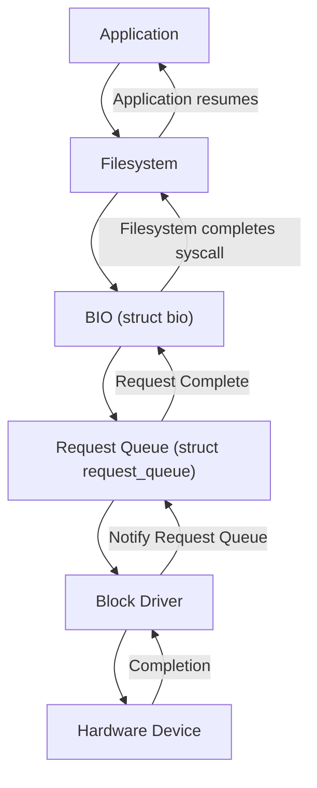

# Chapter 4: I/O Handling

I/O handling is the core of block device drivers. This chapter explains how Linux handles requests, maps memory, and transfers data efficiently.

---

## 4.1 Request Queue Handling (`struct request_queue`)

- **Purpose**: The request queue buffers and schedules I/O operations from the filesystem or applications.
- **Key Concepts**:
  - Each block device has a `struct request_queue`.
  - Requests are stored as **struct request** objects.
  - Supports **merging, splitting, and scheduling** of I/O requests.
- **Initialization Example**:
    ```c
    spinlock_t my_lock;
    struct request_queue *queue;

    queue = blk_init_queue(my_request_function, &my_lock);
    if (!queue) {
        printk(KERN_ALERT "Failed to initialize request queue\n");
    }
    ```
---

## 4.2 Bio Structure (`struct bio`) and Mapping

- **Purpose**: `struct bio` is the basic unit of block I/O in Linux.
- **Contains**:
  - Start sector
  - Number of sectors
  - Memory pages involved
- **Flow**:
  1. Filesystem converts file operations to `bio` objects.
  2. Multiple BIOs can be merged into a single request.
  3. The request queue processes BIOs sequentially or in parallel.
- **Example of BIO mapping**:
    ```c
    struct bio *bio;
    bio = bio_alloc(GFP_KERNEL, num_pages);
    bio->bi_iter.bi_sector = start_sector;
    bio->bi_bdev = my_gendisk->bdev;
    ```
---

## 4.3 Handling Read and Write Requests

- **Request Handler**: Implemented when initializing the request queue.
- **Processing Requests**:
  1. Fetch request from queue:
  ```c
    struct request *req;
    while ((req = blk_fetch_request(queue)) != NULL) {
        // process request
        __blk_end_request_all(req, 0); // complete request
    }
  ```
  2. Determine operation type:
     - **Read** → fetch data from storage and copy to page cache
     - **Write** → copy data from page cache to storage
- **Merging**: Adjacent sectors can be merged for efficiency.

---

## 4.4 Data Transfer (to/from Kernel Memory)

- **Kernel Buffering**:
  - Reads: device → kernel memory → page cache → user space
  - Writes: user space → page cache → kernel memory → device
- **Methods**:
  - bio_kmap() / bio_kmap_atomic() → map BIO pages for CPU access
  - memcpy() → transfer data between kernel buffers and BIO pages
- **Example**:
    ```c
    struct bio_vec bvec;
    struct bvec_iter iter;

    bio_for_each_segment(bvec, bio, iter) {
        void *kaddr = kmap_atomic(bvec.bv_page) + bvec.bv_offset;
        memcpy(kaddr, src_buffer, bvec.bv_len);
        kunmap_atomic(kaddr);
    }
    ```
---

## ✅ Summary

- `struct request_queue` manages and schedules I/O requests efficiently.  
- `struct bio` is the fundamental I/O unit for mapping memory and sectors.  
- Read/write requests are handled via a **request handler**.  
- Data transfer involves moving data to/from kernel memory using BIO mapping.

### I/O Flow Diagram


#### ✅ Explanation

- **Application** issues a read/write system call.  
- **Filesystem Layer** converts file operations into BIO objects.  
- **BIO objects** are submitted to the request queue.  
- **Request Queue** schedules, merges, and forwards requests to the block driver.  
- **Block Driver** programs the hardware device (disk, SSD, NVMe, etc.).  
- **Hardware Device** completes the operation and signals the block driver.  
- **Block Driver** notifies the request queue, completing the BIOs.  
- **Filesystem** completes the syscall and returns control to the application.


```c
#include <linux/module.h>
#include <linux/kernel.h>
#include <linux/blkdev.h>
#include <linux/genhd.h>
#include <linux/hdreg.h>
#include <linux/spinlock.h>
#include <linux/init.h>
#include <linux/bio.h>
#include <linux/vmalloc.h>
#include <linux/string.h>

#define MY_BLOCK_MAJOR 0
#define MY_BLOCK_NAME "myblock"
#define MY_BLOCK_SECTORS 1024
#define MY_BLOCK_MINORS 1
#define SECTOR_SIZE 512

static struct gendisk *my_gendisk;
static struct request_queue *my_queue;
static spinlock_t my_lock;
static u8 *device_data;

// Handle BIOs (read/write)
static int my_transfer(struct bio *bio)
{
    struct bio_vec bvec;
    struct bvec_iter iter;
    void *disk_mem;

    bio_for_each_segment(bvec, bio, iter) {
        disk_mem = device_data + (bio->bi_iter.bi_sector * SECTOR_SIZE);
        void *page_mem = kmap_atomic(bvec.bv_page) + bvec.bv_offset;

        if (bio_data_dir(bio) == READ)
            memcpy(page_mem, disk_mem, bvec.bv_len);
        else
            memcpy(disk_mem, page_mem, bvec.bv_len);

        kunmap_atomic(page_mem);
    }
    return 0;
}

// BIO request handler
static blk_qc_t my_make_request(struct request_queue *q, struct bio *bio)
{
    my_transfer(bio);
    bio_endio(bio);
    return BLK_QC_T_NONE;
}

// Module initialization
static int __init my_block_init(void)
{
    int major;

    // Allocate memory for the "disk"
    device_data = vmalloc(MY_BLOCK_SECTORS * SECTOR_SIZE);
    if (!device_data)
        return -ENOMEM;
    memset(device_data, 0, MY_BLOCK_SECTORS * SECTOR_SIZE);

    // Register block device
    major = register_blkdev(MY_BLOCK_MAJOR, MY_BLOCK_NAME);
    if (major <= 0) {
        vfree(device_data);
        return -EBUSY;
    }

    // Initialize request queue for BIOs
    spin_lock_init(&my_lock);
    my_queue = blk_alloc_queue(GFP_KERNEL);
    blk_queue_make_request(my_queue, my_make_request);
    my_queue->queuedata = NULL;

    // Allocate and initialize gendisk
    my_gendisk = alloc_disk(MY_BLOCK_MINORS);
    my_gendisk->major = major;
    my_gendisk->first_minor = 0;
    my_gendisk->fops = NULL;
    my_gendisk->private_data = NULL;
    snprintf(my_gendisk->disk_name, 32, "myblock0");
    my_gendisk->queue = my_queue;
    set_capacity(my_gendisk, MY_BLOCK_SECTORS);

    // Add disk to system
    add_disk(my_gendisk);

    printk(KERN_INFO "BIO-based block device %s initialized\n", MY_BLOCK_NAME);
    return 0;
}

// Module cleanup
static void __exit my_block_exit(void)
{
    del_gendisk(my_gendisk);
    put_disk(my_gendisk);
    blk_cleanup_queue(my_queue);
    unregister_blkdev(my_gendisk->major, MY_BLOCK_NAME);
    vfree(device_data);
    printk(KERN_INFO "BIO-based block device %s removed\n", MY_BLOCK_NAME);
}

module_init(my_block_init);
module_exit(my_block_exit);

MODULE_LICENSE("GPL");
MODULE_AUTHOR("Example Author");
MODULE_DESCRIPTION("Minimal BIO-based Block Device Driver with Read/Write Data Transfer");
```

#### ✅ Key Features in this Driver

#### BIO Handling
- Implements `my_make_request()` to handle `struct bio` objects directly.  
- Supports both read and write BIOs.  

### Read and Write Requests
- `my_transfer()` checks `bio_data_dir(bio)` to distinguish READ/WRITE.  
- Data is copied between the device memory (`device_data`) and BIO pages.  

### Data Transfer
- Uses `kmap_atomic()` and `memcpy()` to transfer data to/from kernel memory.  
- Emulates a simple in-memory disk.  

### Integration with Kernel
- Registers device with `register_blkdev`.  
- Initializes `gendisk` and adds it to the system.  
- Fully compatible with standard block device I/O interfaces.
